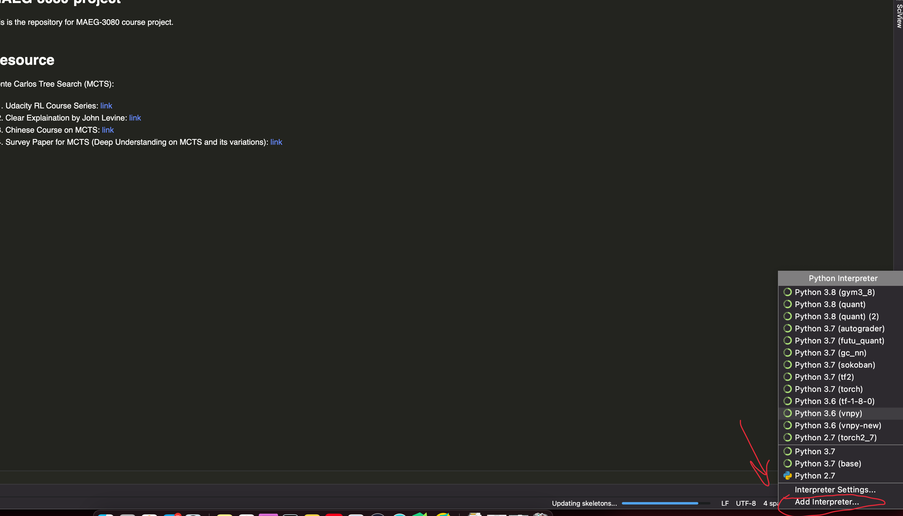

# 00-Setting Up IDE for Developing 

In this tutorial you will learn:

* How to use Pycharm
* How to debug with Pycharm
* How to run jupyter notebook


## 1. Download and Install Pycharm

Pycharm is a good IDE (Integrated Development Enviroment) for python, especially suitable for large project. Here we show how to download and install pycharm. There are two version of pycharm: Community and Professional. You can choose one of them:

* Pycharm Community
	 Go to official webiste [link](https://www.jetbrains.com/pycharm/) and download.
	 

* Pycharm Professional (recommended)
		1.Go to official webiste [link](https://www.jetbrains.com/pycharm/).
		2. Sign up an account with CUHK student email for free
		3. Download and install Pycharm Pro and activate.


## 2. How to Setup Up a Pycharm Project

## 2.1 Download codes

Dowload our project codes from [https://github.com/linhongbin-ws/MAEG-3080-project](https://github.com/linhongbin-ws/MAEG-3080-project) to your local computer.

If you are using terminal, just type

```
git clone https://github.com/linhongbin-ws/MAEG-3080-project
```

Or you can just directly click Dowload Zip button on the webpage and unzip the items.

## 2.2 Open codes as pycharm project

Click `file`->`open` button on the navigation bar in pycharm, and navigate to the root path your downloaded codes, for example: `/Users/linhongbin/codes/TA/MAEG3080/MAEG-3080-project`, click `open`.

Pycharm will initiate it as a pycharm project.

Here are the overview of functions for pycharm

<p align="center">

</p>

## 2.3 Open a new terminal on pycharm

In the bottom left corner, there is a `terminal` button. Click it to open a new terminal. Click `+` to have multiples terminals.
<p align="center">

</p>


## 3 Install Anaconda and set it up with pycharm

### 3.1 Install Anaconda

Anaconda is a great manager for python packages and can create virtual environment for different project. 

Go to official website to download and install anaconda [https://www.anaconda.com/](https://www.anaconda.com/).


### 3.2 create a virtual environemnt
 
Since python projects might rely on dependency specific to their project such as python version, package dependency, it is important to use virtual environment to manage these dependency. Conda provides the powerful virtual environment for python. To use create a new virtual environment for our project, open a terminal and type:

```sh
conda create -n torch python=3.6 anaconda

```

After finishing, type

```sh
conda activate torch
```

Then you finish creating the virtual environment. You will see there is a `(torch)` at the beginning of terminal line, which means that your virtual environment has bee activated.

<p align="center">

</p>

To install the dependency of our project, type

```sh
pip install -r requirements.txt
```
Then it will install all dependency.

### 3.3 Setup virtual environment for pycharm

Here we will set the virtual environment as the interpreter of the project. Go to the right bottom corner and click the Interpreter button 

<p align="center">

</p>

And click `Add Interpreter`
<p align="center">

</p>

Then 

* Select `Conda Environment`
* Select`Existing environment`, 
* click `...` to find your conda environment python interpreter path. Should be a path like `xxxxxx/anaconda3/envs/torch/bin/python` 
* click `Make available to all projects`
* click `OK`
<p align="center">

</p>


Then you complete setting up virtual environment for pycharm

### 3.4 Install Pytorch

The best way to install pytorch is to use conda. Follow the instructions on [https://pytorch.org/](https://pytorch.org/) for installing pytorch on your computer.


### 3.5 Install Jupyter Notebook

Open a terminal, type

```sh
conda install -c conda-forge jupyterlab

```

Here we need to type the following command to make jupyeter notebook recognize our virtual environment:

```sh
conda install -c anaconda ipykernel
python -m ipykernel install --user --name=torch
```

Then you finish setup the jupyter notebook.


 
