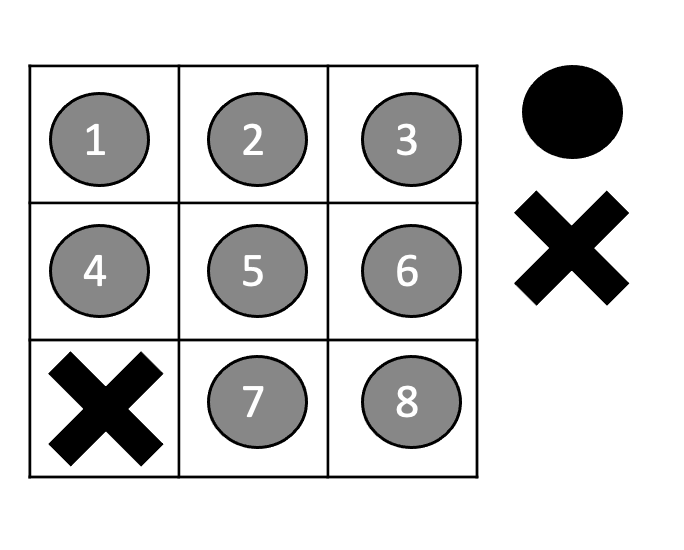
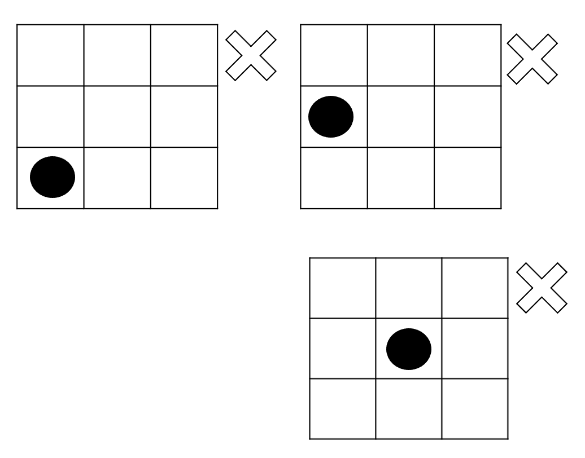
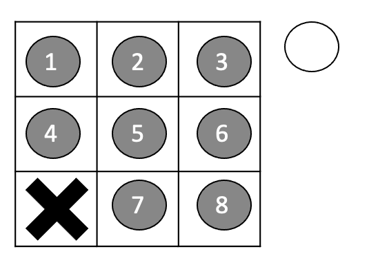

# Monte Carlos Tree Search (MCTS) Tutorial

In this tutorial, you will learn:

-  The basics theory of MCTS
-  How to code a MCTS
-  Intuition behind MCTS (Why it works!)

We will build the knowledge upon the real application (Tic Tac Toe) to get intuitions about what, 
how and why MCTS works well in chess plays and other AI applications.

## Tic-Tac-Toe

Tic-Tac-Toe is a game that two players take turns playing on a three-by-three board. 
One player plays Xs and the other Os until one player wins by placing three marks in a row, horizontally, 
vertically, or diagonally.

Try this online game to get a feeling of Tic-Tac-Toe. 

[[link](https://playtictactoe.org/)]

In this tutorial, we will try to develop a program (sotisficated AI) that will achieve human AI for the Tic-Tac-Toe Game.

## A Naive AI for solving Tic-Tac-Toe

Here we try to explain what is state. 
The state is the representation information to describe the current situation of environment.
In the case of tic-tac-toe, the state is the current situation of the chess board. 
The following picture is three states in the chess game.

Given a state, we have one or multiple choices of available actions corresponding to the state.
Let us take the first state in the above picture as example. The available actions can be listed as following:

Player can put the "O"s to position 1 to 8 as the above picture shows. 

Ok, now if you are the player, which action among the available actions given this state will be the best or the smartest move?

Perhaps the most natural thing comes to your mind is to calculate the winning ratio of action given a particular state.
But how to calculate the winning ratio? Maybe one of the feasible ways is to do simulations to estimate and foresee the winning ratio of actions. 
Just like Doctor Strange!

For example, given action 1, we can do hundreds of simulation to estimate the winning ratio. 

Eventually, you might calculate the winning ratios for states like this

