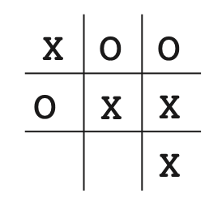

# Monte Carlos Tree Search (MCTS) Tutorial

In this tutorial, you will learn:

-  The basics theory of MCTS
-  How to code a MCTS
-  Intuition behind MCTS (Why it works!)

We will build the knowledge upon the real application (Tic Tac Toe) to get intuitions about what, how and why MCTS works well in chess plays and other AI applications.

## Tic-Tac-Toe

Tic-Tac-Toe is a game that two players take turns playing on a three-by-three board. One player plays Xs and the other Os until one player wins by placing three marks in a row, horizontally, vertically, or diagonally.

Try this online game to get a feeling of Tic-Tac-Toe. [[link](https://playtictactoe.org/)]

In this tutorial, we will try to develop a program (sotisficated AI) that will achieve human AI for the Tic-Tac-Toe Game.

## A Naive AI for solving Tic-Tac-Toe

If somebody ask you to design a AI for the Tic-Tac-Toe chess game, the first algorithm comes to your mind might be deep q learning.