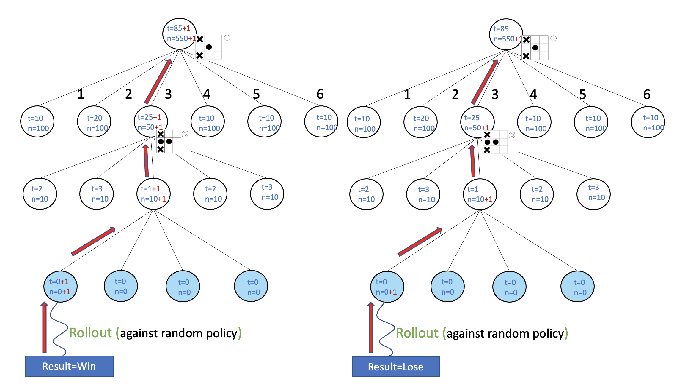
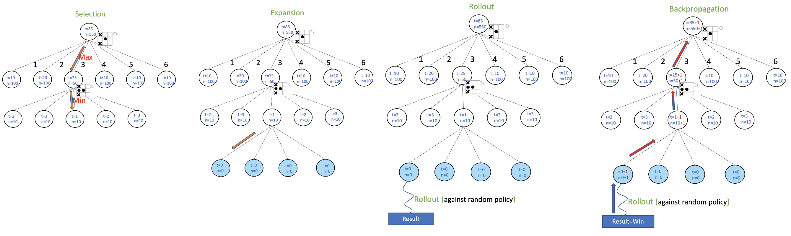

# Monte Carlos Tree Search (MCTS) Tutorial

In this tutorial, you will learn:

-  The basics theory of MCTS
-  A naive AI for tic-tac-toe
-  MCTS for tic-tac-toe
-  MCTS with UCB1 for tic-tac-toe
-  Intuition behind Upper Confidence Bounded 1 (UCB1) (Why it works!)

We will build the knowledge upon the real application (Tic Tac Toe) to get intuitions about what, how and why MCTS works well in chess plays and other AI applications.

## 1. Tic-Tac-Toe 

Tic-Tac-Toe is a game that two players take turns playing on a three-by-three board. One player plays Xs and the other Os until one player wins by placing three marks in a row, horizontally, vertically, or diagonally.

Try this online game to get a feeling of Tic-Tac-Toe. [[link](https://playtictactoe.org/)]

In this tutorial, we will try to develop a program (sotisficated AI) that will achieve human AI for the Tic-Tac-Toe Game.

## 2. A Naive AI for solving Tic-Tac-Toe

Here we try to explain what is state. The state is the representation information to describe the current situation of environment. In the case of tic-tac-toe, the state is the current situation of the chess board. The following picture is three states in the chess game.

<!---->

Note that the white "X" or "O" indicates the current turn for two players.

Given a state, we have one or multiple choices of available actions corresponding to the state. Let us take the first state in the above picture as example. The available actions can be listed as following:
<!--
-->

Player can put the "O"s to position 1 to 8 as the above picture shows. 

Ok, now if you are the player, which action among the available actions given this state will be the best or the smartest move?

Perhaps the most natural thing comes to your mind is to calculate the winning ratio of action given a particular state.
But how to calculate the winning ratio? Maybe one of the feasible ways is to do simulations to estimate and foresee the winning ratio of actions. 
Just like Doctor Strange!
<!--

-->

For example, given action 1, we can do hundreds of simulation to estimate the winning ratio. Eventually, you might calculate the winning ratios for states like this

The number in black in the above picture is the probabity of winning ratio. Note that probabilities of all action sum to 1. Based on the result, you can make a "smart" moving, the one with the highest probability. That is Action 5, with probability 0.89, in the above picture.

## 3. Monte Carlos Tree Search for solving Tic-Tac-Toe

So far, you might feel that the naive approach might be too unrealistic. You are right. One of the most significant drawback is that the simulations grows with the number of all state-action pairs in the game. We can calculate the number of all state-action pairs for tic-tac toe as

If you do 100 simulation for an action-state pair, you need to do 362880*100 simuations. That might be durable for some of the computers. But given a 10 by 10 board, the number of state-pair is fatorial of 100, 9.332622e+157, which is definitely out of computational power. In fact, given a n by n board, the number of state-pair is .

So is there some methods to create a more data-efficient AI? You know when professional players play a chess game, they will plan their moves a few steps ahead. In such method, they can try to foresee the resultant future states which an action might lead to. In AI theory, there is a similar method that is able to foresee the states. That is Monte Carlos Tree Search.

### 3.1 Basics of Tree

Let us try to foresee by planning the move.

In the above picture, we illustrate the planning using a tree structure. Since the tree is large, only a part of the entire tree is shown in the picture. To simplfy the representation of above picture, we use the following illustratio, simply using nodes and edges.

The node represent state and the edge represent available action. This allows us to analyse the resultant states of each action and its further consequence. Let us look deeper into the tree .

As you might notice, each state has a blue number. The value means the winning probability of "O" given the current state (or the value in reinforcement learning). The above picture shows the deep tree with 3 step-look ahead. 

### 3.2 How to traverse the tree (Selection)

So the next question might be how to jump from the parent node to the child node. Since the blue number for each state means winning ratio of Player "O", the rules of traverse is easily set as:

- Choose the available action with Maximum winning ratios of "O" at the turn of "O".
- Choose the available action with Minimum winning ratios of "O" at the turn of "X".

Such a rule is known as "MinMax", which is a famous algorithm in game theory.

Why do we try to minimize the winning ratios of "O" at the turn of "X"? Because we try to make the player "X", the opponent of "O", be "smart" on his decision. An analogy I like to think about is that people will tend to play against the opponent is better or at least the same with their own for chess play to improve their skill of playing chess. In general, "MinMax" algorithm or the rules of traverse can impose some contraints for exploratios that finds the optimal policy.

### 3.3 How to expand or "grow" the tree (Expansion)

 After you traverse the tree using "MinMax" algorithm, you will reach leaf nodes (the bottom of the tree). If you want to grow the tree to see a few more move ahead, you need to expand (or in other word "grow") the tree. It is easy to exand the tree as:
 
 - Add new nodes (representing new states) to the leaf nodes.
 - Initialize the nodes with initial values. In our case, just we initialze the value of winning ratio to zero.

[wiki link](https://zh.wikipedia.org/wiki/%E6%9E%81%E5%B0%8F%E5%8C%96%E6%9E%81%E5%A4%A7%E7%AE%97%E6%B3%95)

### 3.4 How to estimate the probability of winning ratio for a node 

From the perspective of frequentists, the probability of winning ratio can be estimated using statistics, such as Monte Carlo methods. Let us check the following picture

n is the number of game plays starting at the current state, t is the number of winning plays starting at the current state. The estimated probability of wining ratio is formulated as

As the  grows larger, the estimated probability get more accurate. So we might need to do simulations as many as possible to get an accurate winning ratio. Next we will explain how to increase the number of simulated plays.

### 3.5 Simulation (Rollout) 

For MCTS, after traverse and expansion process, we will reach the leaf node. We will do rollout (or simulation in other word) when we find n=0.

In the rollout, the learned policy will play againts a random policy, which might be the policy that give uniform random moves. After the simulation, we record the result.

### 3.6 Update Result(Backpropagation) 

After a rollout, we will update the tree based on the result of rollout. 

 

As the above picture shows, we divide the cases into two:

- Case 1 (Player win): n and t are incremented by 1 for the rollout state, its parent state and its ancestral states.
- Case 2 (Player lose): n is incremented by 1 for the rollout state, its parent state and its ancestral states.

You might notice that the value is updated backward for the tree, which is similar to the backpropagation of gradient descent for neural neworks.

### 3.7 A full process of MCTS 

 

The process of MCTS for one playout is set as the follow sequences: 

- Selection -> Expasion -> Rollout -> Backpropagation. 

For MCTS, in order to approximate the probabilities of winning ratios accurately, we will try to execute playouts as many as possible.

## 4 Monte Carlos Tree Search with UCB1

After you play with MCTS a while, you will find out there is a problem with the original MCTS algorithm. Specifically, "MinMax" algorithm will always choose actions with the maximum probabilites. At the beginning of playouts when the tree is small, the estimated probabilies might be not accurate due to its small sampling number n. This might lead to choose sub-optimal actions, while other actions that might be optimal will be not selected. In the terminology of reinforcement learning, the sub-optimal actions are "exploited" too much, leaving other actions "un-explored".

"Exploitation and Exploratio" is a well known tradeoff in reinforcement learning. One might need to balance the tradeoff in order to find an optimal policy. 

UCB1 (Upper Confidence Bound) is able to balance the "Exploitation" and "Exploratio" for MCTS. The UCB1 value for a state can be formulated as

where N is the n value for its parent states.

"Minmax" algorithm with UCB1 can be formulated as

- Choose the available action with Maximum UCB for the your turn.
- Choose the available action with Minimum UCB for the opponent turn.

For the sake of compuational convinience, we maximize the negative probability for the opponent turns. The "Minmax" algorithm with UCB1 can be reformulated as

- 
- Choose the available action with Maximum UCB.

Where K is the number of turns, here we assume that the first turn is your turn. 

### Intuition of UCB1 

Why does UCB1 work for balancing the tradoff of "exploratio" and "exploitation"?

Let look at the following cases:

-Case 1:

 

At the bottom, there are two leaf nodes has been visited since n is not equal to zero, While the other leaf nodes remain un-visited. You will find that UCB values for un-visited leaf nodes tend to infinity. Following the rule of "MinMax", those nodes that has never been visited before will be selected. In this case, the UCB values will encourage "exploratio".

-Case 2:

 

When all the sibling node has been visited many time, the difference among their the terms in UCB  will be small. However, UCB will weight more on the difference of the other term . In this case, the UCB values will encourage "exploitation".

In conclusion, UCB will encourage "Exploratio" when the number of visits, n, for sibling nodes is small, while encourage "Exploitation" when n is large. This make sense in some level since at the begining of playouts, the estimation of winning ratio is not too accurate. Encouraging "Exploitation" will prevent the cases that miss out the nodes leading to the optimal policy. When n is large, the estimation become more accurate. So encouraging "Exploitation" will make the tree grow deeper, which contributes to the data efficiency of finding optimal solution.

**Reference**:

1. Clear Explaination by John Levine: [link](https://www.youtube.com/watch?v=UXW2yZndl7U&t=2s&ab_channel=JohnLevine)

1. Chinese Course on MCTS: [link](https://www.youtube.com/watch?v=niIaKaWIRX0&ab_channel=%E4%B8%AD%E5%9B%BD%E5%A4%A7%E5%AD%A6MOOC-%E6%85%95%E8%AF%BE)

1. Survey Paper for MCTS (Deep Understanding on MCTS and its variations): [link](https://ieeexplore.ieee.org/stamp/stamp.jsp?arnumber=6145622&casa_token=AecTrST5MJYAAAAA:1UepYH0lA9-jdodOaItjidj0ie8kcKFAH65qh4F3AzkX1wiWrfNj4lb5Um-w7RJChEu0heo3&tag=1)

1. Simple code of MCTS [link](https://github.com/haroldsultan/MCTS)

